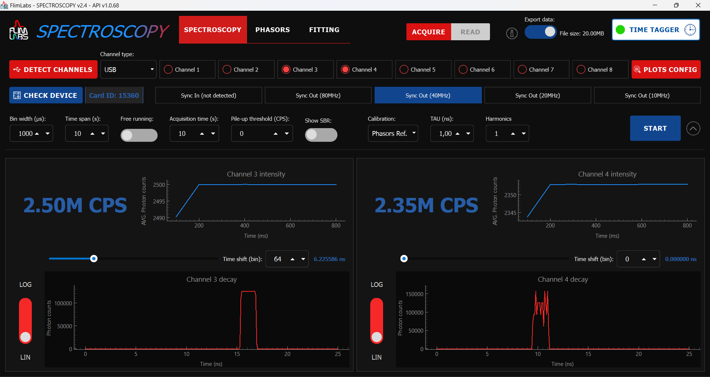

<a name="readme-top"></a>

<div align="center">
  <h1>Spectroscopy Laserblood</h1>
</div>
<div align="center">
  <a href="https://www.flimlabs.com/">
    
  </a>
</div>
<br>


<!-- TABLE OF CONTENTS -->
<details>
  <summary>Table of Contents</summary>
  <ol>
    <li>
      <a href="#about-the-project">About The Project</a>
      <ul>
        <li><a href="#built-with">Built With</a></li>
      </ul>
    </li>
    <li>
      <a href="#getting-started">Getting Started</a>
      <ul>
        <li><a href="#prerequisites">Prerequisites</a></li>
        <li><a href="#installation">Installation</a></li>
      </ul>
    </li>
    <li><a href="#usage-guides">Usage Guides</a></li>
    <li><a href="#license">License</a></li>
    <li><a href="#contact">Contact</a></li>
  </ol>
</details>

# About the project

<div align="center">
    
</div>


Welcome to [FLIM LABS Spectroscopy Laserblood](https://github.com/flim-labs/spectroscopy-py/tree/laserblood), a Python application designed to **analyze the fluorescence intensity decay as a function of time**. Facilitated by an underlying data processor developed in Rust, responsible for data retrieval from the hardware component, this application enables real-time data analysis and visualization. Whether your focus is on rigorous data analysis or dynamic visualizations, Spectroscopy serves as a flexible tool for the precise measurement and exploration of fluorescence intensity decay profile and lifetimes distributions.

### Built With

* [Python](https://www.python.org/)
* [PyQt6](https://pypi.org/project/PyQt6/)
* [pyqtgraph](https://www.pyqtgraph.org/)
* [matplotlib](https://pypi.org/project/matplotlib/)
* [numpy](https://numpy.org/)
* [scipy](https://scipy.org/)
* [flim-labs](https://pypi.org/project/flim-labs/)


<!-- GETTING STARTED -->

## Getting Started

### Prerequisites

To be able to run this project locally on your machine you need to satisfy these requirements:

- Windows OS (>= Windows 10)
- 4GB RAM
- Multicore CPU
- Possess a [FLIM LABS acquisition card](https://www.flimlabs.com/products/data-acquisition-card/) to be able to acquire your data
- ZestSC3 drivers installed
- Python version <= 3.9

### Installation

1. Clone the repo
   ```sh
   git clone https://github.com/flim-labs/spectroscopy-py
   ```

2. Switch to the correct branch
   ```sh
   git checkout laserblood
   ```

3. Set the virtual environment in the root folder
   ```sh
   python -m venv venv
   ```
4. Activate the virtual environment:
   ```sh
   venv\Scripts\activate
   ```
5. Install the dependencies
   ```sh
   pip install -r requirements.txt
   ```
6. Run the project with GUI mode
   ```sh
   python spectroscopy.py
   ```

## Usage Guides

Navigate to the following links to view detailed application usage guides:

- [Spectroscopy Laserblood GUI guide](./v3.1/index.md)
- [Spectroscopy Laserblood Data Export guide ](./python-flim-labs/spectroscopy-file-format.md)
- [Spectroscopy Laserblood Console guide](./python-flim-labs/spectroscopy-console.md)

## Contact

FLIM LABS: info@flimlabs.com

Project Link: [FLIM LABS - Spectroscopy Laserblood](https://github.com/flim-labs/spectroscopy-py/tree/laserblood)

<p align="right">(<a href="#readme-top">back to top</a>)</p>
