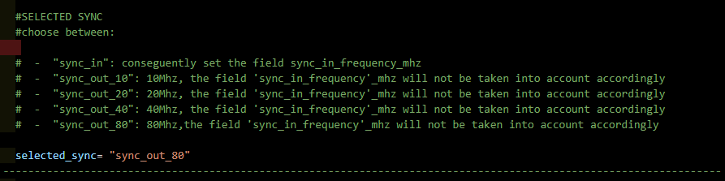
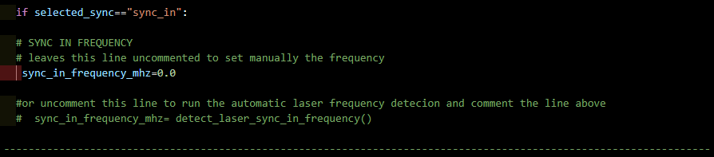
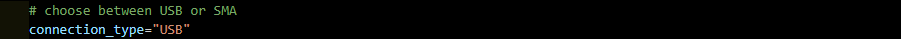
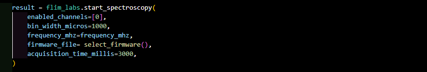

  <h1>Spectroscopy - Console mode </h1>

  

 

<!-- TABLE OF CONTENTS -->

  
Table of Contents

  <ol>
    <li>
      <a href="#console-usage">Console Usage</a>
      <ul>
          <li><a href="#parameters configuration">Parameters configuration</a>
              <ul>
                  <li><a href="#sync">Sync</a></li>
                  <li><a href="#sync-in-frequency">Sync in frequency</a></li>
                  <li><a href="#connection-type">Connection type</a></li>
                  <li><a href="#enabled-channels">Enabled channels</a></li>
                  <li><a href="#bin-width">Bin width</a></li>
                  <li><a href="#acquisition-time">Acquisition time</a></li>                                   
              </ul>
          </li>
          <li><a href="#start-the-data-acquisition">Start the data acquisition</a></li> 
      </ul>
    </li>
    <li><a href="#useful-links">Useful links</a></li>
    <li><a href="#license">License</a></li>
    <li><a href="#contact">Contact</a></li>
  </ol>

## Console usage

    <!--  -->

The [Spectroscopy](https://github.com/flim-labs/spectroscopy-py) Console mode provides live-streaming data representation directly in the console, without an interface intermediary and charts data visualization processes.
The data displayed on the console screen indicates **the cannel** (number), **the moment of acquisition** (in seconds) and the corresponding **decay curve values** of 256 chart points detected during that time.

### Parameters configuration

#### Sync

 

    

 

Set the _selected_sync_ variable value choosing from the following:

- `"sync_in"`: conseguently set the field sync_in_frequency_mhz
- `"sync_out_10"` : 10Mhz, the field `sync_in_frequency_mhz` will not be taken into account accordingly
- `"sync_out_20"` : 20Mhz, the field `sync_in_frequency_mhz` will not be taken into account accordingly
- `"sync_out_40"` : 40Mhz, the field `sync_in_frequency_mhz` will not be taken into account accordingly
- `"sync_out_80"` : 80Mhz,the field `sync_in_frequency_mhz` will not be taken into account accordingly

(<a href="#video">check the video</a>) (<a href="#readme-top">back to top</a>)

#### Sync in frequency

 

    

 

Perform this step only if you have set `selected_sync="sync_in"`.

Set the value of the `sync_in_frequency_mhz` variable.  
You can set the value manually by changing the value in the line `sync_in_frequency_mhz=0.0`.

Alternatively, you can use the automatic laser frequency detection feature. To do this, comment out the line `sync_in_frequency_mhz=0.0` and uncomment the line `# sync_in_frequency_mhz= detect_laser_sync_in_frequency()` .

(<a href="#video">check the video</a>) (<a href="#readme-top">back to top</a>)

#### Connection type

 

    

 

Set the value of the variable `connection_type_ accordingly`, to `connection_type="USB"` if you are using a USB cable, or to `connection_type="SMA"` if you are using an SMA cable to connect to your FLIM LABS acquisition card.

(<a href="#video">check the video</a>) (<a href="#readme-top">back to top</a>)

#### Enabled channels

 

    

 

Set the number of selected channels using the enabled_channels variable.

Set to `0` if you want to select channel 1, set to `1` if you want to select channel 2, and so on up to channel 8 (value `7`).

You must select at least one channel, up to a maximum of 8. If you want to select more than one channel, separate the values with a comma as in the example:

`enabled_channels= [0,2,4]`

In the example, channels 1 (value `0`), 3 (value `2`), and 5 (value `4`) are selected.

(<a href="#video">check the video</a>) (<a href="#readme-top">back to top</a>)

#### Bin width

Set the bin width value through the `bin_width_micros` variable.
The value must be a number.

Example: `bin_width_micros=1000`

[Check image](#console_activation_function)

(<a href="#video">check the video</a>) (<a href="#readme-top">back to top</a>)

#### Acquisition time

Set the acquisition time value through the `acquisition_time_millis` variable.
The value must be a number.

Example: `acquisition_time_millis=3000`

[Check image](#console_activation_function)

(<a href="#video">check the video</a>) (<a href="#readme-top">back to top</a>)

Here a table summary of the configurable parameters:

|                           | data-type   | config                                                                                              | default     | explanation                                                                                                |
| ------------------------- | ----------- | --------------------------------------------------------------------------------------------------- | ----------- | ---------------------------------------------------------------------------------------------------------- |
| `selected_sync`           | string      | choose a value from `"sync_in"`, `"sync_out_10"`, `"sync_out_20"`, `"sync_out_40"`, `"sync_out_80"` | `"sync_in"` | select whether you will connect to the `sync_in` or the `sync_out` port of your FLIM LABS acquisition card |
| `enabled_channels`        | number[]    | set a list of enabled acquisition data channels (up to 8). e.g. [0,1,2,3,4,5,6,7]                   | [1]         | the list of enabled channels for photons data acquisition                                                  |
| `bin_width_micros`        | number      | Set the numerical value in microseconds                                                             | 1000 (ms)   | the time duration to wait for photons count accumulation.                                                  |
| `acquisition_time_millis` | number/None | Set the data acquisition duration                                                                   | None        | The acquisition duration could be determinate (_numeric value_) or indeterminate (_None_)                  |

 
(<a href="#video">check the video</a>) (<a href="#readme-top">back to top</a>)

### Start the data acquisition

Once you have completed the settings of the variables mentioned above, you are ready to start the data acquisition.
In order to do that, open your console and be sure to be on the project directory `/SPECTROSCOPY-PY` and follow run the following commands:

- `python -3.9 -m venv venv`
- `venv/scripts/activate`
- `pip install -r requirements.txt`
- `python console.py`

The software will start the data acquisition and the console will log the acquired data in the following format:
Lorem Ipsum

(<a href="#video">check the video</a>) (<a href="#readme-top">back to top</a>)

## Useful Links

For more details about the project follow these links:

- [Spectroscopy introduction](../index.md)
- [Spectroscopy GUI guide](../v1.1/index.md)

(<a href="#readme-top">back to top</a>)

## License

Distributed under the MIT License.

(<a href="#readme-top">back to top</a>)

<!-- CONTACT -->

## Contact

FLIM LABS: info@flimlabs.com

Project Link: [FLIM LABS - Spectroscopy](https://github.com/flim-labs/spectroscopy-py)

(<a href="#readme-top">back to top</a>)

