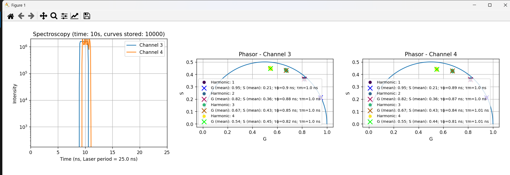

<a name="readme-top"></a>

<div align="center">
  <h1>Spectroscopy - Export Data </h1>
</div>
<div align="center">
  <a href="https://www.flimlabs.com/">
    
  </a>
</div>
<br>

<!-- TABLE OF CONTENTS -->
<details>
  <summary>Table of Contents</summary>
  <ol>
    <li>
      <a href="#introduction">Introduction</a>
    </li>
    <li><a href="#spectroscopy-file-format">Spectroscopy File Format</a></li>
     <li><a href="#phasors-file-format">Phasors File Format</a></li>
    <li><a href="#data-visualization">Data Visualization</a>
    </li>
    </ul>
    </li>
    <li><a href="#useful-links">Useful links</a></li>
    <li><a href="#license">License</a></li>
    <li><a href="#contact">Contact</a></li>
  </ol>
</details>

## Introduction

<div align="center">
    
</div>

The [Spectroscopy](https://github.com/flim-labs/spectroscopy-py) software allows seamless export of **decay curves** and **phasors** data to binary files, with convenient plotting and visualization capabilities. This guide provides an in-depth exploration of the **binary files structure**, offering a comprehensive understanding of how exported data is formatted and can be leveraged.

<p align="right">(<a href="#readme-top">back to top</a>)</p>

## Spectroscopy File Format

Here a detailed explanation of the exported Spectroscopy binary data file structure:

##### Header (4 bytes):

The first 4 bytes of the file must be `SP01`. This serves as a validation check to ensure the correct format of the file. If the check fails, the script prints "Invalid data file" and exits.

##### Metadata Section (Variable length):

Following the header, metadata is stored in the file. This includes:

- `JSON length (4 bytes)`: An unsigned integer representing the length of the JSON metadata.
- `JSON metadata`: This is a variable-length string that contains information about the data, including _enabled channels_, _bin width_, _acquisition time_, _laser period_ and _tau ns_. This information is printed to the console.

##### Data Records (Variable length):

After the metadata, the script enters a loop to read and process data in chunks of variable length, depending on the number of active channels. Each chunk represents a data record containing:

- `Timestamp (8 bytes)`: A double representing the data acquisition time in seconds.
- `Channel Cumulated Curve Values (variable length)`: A variable number of unsigned integers (4 bytes each) representing cumulated decay curve for each active channel at the corresponding timestamp. For each active channel, **256 values are stored as 4-byte unsigned integers**.
The length of each data record is calculated as:

    - **8 bytes** for the timestamp.
    - **1024 bytes** for each active channel (256 values of 4 bytes each).

For example, if there are _3_ active channels, the total length of a data record will be `8 + 1024 * 3 = 3080 bytes`.

<p align="right">(<a href="#readme-top">back to top</a>)</p>


## Phasors File Format

Here a detailed explanation of the exported Phasors binary data file structure:

##### Header (4 bytes):

The first 4 bytes of the file must be `SPF1`. This serves as a validation check to ensure the correct format of the file. If the check fails, the script prints "Invalid phasors_data file" and exits.

##### Metadata Section (Variable length):

Following the header, metadata is stored in the file. This includes:

- `JSON length (4 bytes)`: An unsigned integer representing the length of the JSON metadata.
- `JSON metadata`: This is a variable-length string that contains information about the data, including _enabled channels_, _bin width_, _acquisition time_, _laser period_, _harmonics_ and _tau ns_. This information is printed to the console.

##### Data Records (Variable length):

After the metadata, the script enters a loop to read and process phasor data. Each data record contains:

- `Timestamp (8 bytes)`: An unsigned integer representing the timestamp of the data in nanoseconds.
- `Channel Index (4 bytes)`: A string representing the name of the channel index.
- `g (8 bytes)`:   A float representing the real part of the phasor (X axis).
- `s (8 bytes)`: A float representing the imaginary part of the phasor (Y axis).


<p align="right">(<a href="#readme-top">back to top</a>)</p>

## Data Visualization

The script files are automatically downloaded along with the acquisition .bin file once the acquisition is complete and a file name has been chosen. Follow one of the guides below if you wish to use the Python or Matlab script:

- **Python script**:

  - Open the terminal and navigate to the directory where the saved files are located (it is advisable to save and group them in a folder):

    ```sh
    cd YOUR_DOWNLOADED_DATA_ROOT_FOLDER
    ```

  - Create a virtual environment using the command:
    ```sh
    python -m venv venv
    ```
  - Activate the virtual environment with the command:
    ```sh
    venv\Scripts\activate
    ```
  - Install the necessary dependencies listed in the automatically downloaded _requirements.txt_ with:
    ```sh
    pip install -r requirements.txt
    ```
  - Run your script with:
    ```sh
    python YOUR_SCRIPT_NAME.py
    ```
    <br>

- **Matlab script**:  
   Simply open your MATLAB command window prompt and, after navigating to the folder containing the script, type the name of the script to launch it.


## Useful Links

For more details about the project follow these links:

- [Spectroscopy introduction](../index.md)
- [Spectroscopy GUI guide](../v2.6/index.md)
- [Spectroscopy Console guide ](./spectroscopy-console.md)

<p align="right">(<a href="#readme-top">back to top</a>)</p>

## License

Distributed under the MIT License.

<p align="right">(<a href="#readme-top">back to top</a>)</p>

<!-- CONTACT -->

## Contact

FLIM LABS: info@flimlabs.com

Project Link: [FLIM LABS - Spectroscopy](https://github.com/flim-labs/spectroscopy-py)

<p align="right">(<a href="#readme-top">back to top</a>)</p>
