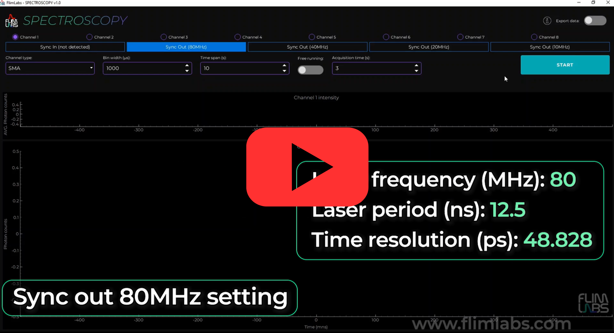

<a name="readme-top"></a>

<div align="center">
  <h1>Spectroscopy v1.0</h1>
</div>
<div align="center">
  <a href="https://www.flimlabs.com/">
    
  </a>
</div>
<br>

<!-- TABLE OF CONTENTS -->
<details>
  <summary>Table of Contents</summary>
  <ol>
    <li>
      <a href="#introduction">Introduction</a>
    </li>
    <li><a href="#gui-usage">GUI Usage</a>
        <ul>
            <li><a href="#sync-in-and-sync-out">Sync in and sync out</a></li>
            <li><a href="#acquisition-channels">Acquisition channels</a></li>
            <li><a href="#connection-type">Connection type</a></li>
            <li><a href="#bin-width">Bin width</a></li>
            <li><a href="#acquisition-mode">Acquisition mode</a></li>
            <li><a href="#acquisition-time">Acquisition time</a></li>
            <li><a href="#time-span">Time span</a></li>
             <li><a href="#export-data">Export Data</a></li>
        </ul>
    </li>
    <li><a href="#parameters-table-summary">Parameters table summary</a>
    <li><a href="#automatic-plot-update">Automatic plot update</a>
        <ul>
            <li><a href="#pull-from-queue-function">Pull from queue function</a></li>
            <li><a href="#update-plot-2-function">Update plot 2 function</a>
                <ul>
                    <li><a href="#update-the-photon-intensity-plot">Update the photon intensity plot</a></li>
                    <li><a href="#update-the-photon-intensity-decay-plot">Update the photon intensity decay plot</a></li>
                    <li><a href="#gui-update">GUI update</a></li>
                 </ul>
            </li>         
         </ul>
      <li><a href="#automatic-firmware-detection">Automatic firmware detection</a></li>
      <li><a href="#automatic-firmware-detection">Export Data Visualization</a></li>    
    <li><a href="#license">License</a></li>
    <li><a href="#contact">Contact</a></li>
  </ol>
</details>

<!-- ABOUT THE PROJECT -->

## Introduction

Welcome to [FLIM LABS Spectroscopy](https://github.com/flim-labs/spectroscopy-py) _v1.0_ usage guide. In this documentation section, you will find all the necessary information for the proper use of the application's **graphical user interface** (GUI).
For a general introduction to the aims and technical requirements of the project, read the [Spectroscopy Homepage](../index.md) link.

<p align="right">(<a href="#readme-top">back to top</a>)</p>

<!-- USAGE EXAMPLES -->

## GUI Usage

[](https://www.youtube.com/watch?v=LVi3BD7OFrw)

The GUI mode provides advanced functionality for configuring analysis **parameters** and displaying live-streamed fluorescence intensity decay data. It allows simultaneous acquisition from up to **8 channels**, offering real-time data visualization in the form of plots.
There are two types of graphs used to represent the data:

Photon intensity graph:

- **X** Axis: represent _aquisition time_
- **Y** Axis: represent _average photon counts_

Photon intensity decay graph:

- **X** Axis: represent _aquisition time_
- **Y** Axis: represent _average photon counts_

Here an overview of each available feature:

#### Sync in and sync out

By selecting `Sync In`, you will automatically initiate the process of measuring your laser's frequency. Alternatively, by selecting one of the `Sync Out` options, you can choose the desired frequency (`80MHz`, `40MHz`, `20MHz`, `10MHz`). When the [export data mode](#export-data) is active, the size of the generated file will increase in accordance with the number of active channels.

Selecting the Sync value is essential, as it determines the **laser frequency** and directly impacts the **laser period** and the **time resolution** of the measurements. A higher frequency reduces the laser period, enhancing the **time resolution** and enabling the capture of events in shorter time intervals.  
The X-axis of the graphs reflects the laser period, depicting the time period of a single laser pulse. This aspect is crucial because the decay curve represented on the graph is the sum of curves from each chunk, where each **chunk** is defined by the **bin width** [refer to the bin width section for more details](#bin-width).

The software **automatically adjusts** the time resolution according to the selected frequency, ensuring precision.  
Each decay curve is represented by **256 points**, maintaining this constancy despite changes in frequency or temporal resolution.

Selecting a `Sync out` of 80MHz, we obtain a laser period of 12.5 ns and a temporal resolution of about 48.828 ps; thus, each point represents an interval of approximately 48.828 ps across the cumulative decay curves.

Conversely, at 20MHz, the laser period extends to 50 ns with a temporal resolution of about 195.312 ps, indicating that each point on the curve corresponds to an interval of approximately 195.312 ps across the cumulative decay curves of each chunk.

<hr>

#### Acquisition channels

The software allows for data acquisition in **single-channel** or **multi-channel** mode, with the user able to activate up to _8_ channels simultaneously.

For each activated channel, its respective real-time acquisition plot will be displayed on the interface.

The number of active channels affects the _size of the exported data file_. With the same values set for `bin width ` and `acquisition time `, the file size _grows proportionally to the number of activated channels_.

To start acquisition, at least one channel must be activated.

_Note: Ensure that the channel activated in the software corresponds to the channel number being used for acquisition on the [FLIM LABS Data Acquisition Card](https://www.flimlabs.com/products/data-acquisition-card/)._

<hr>

#### Connection type

The user can choose the type of connection for data acquisition between **SMA** and **USB** connections.

_Note: The connection type set in the software must match the actual connection type activated on the [FLIM LABS Data Acquisition Card](https://www.flimlabs.com/products/data-acquisition-card/)._

<hr>

#### Bin width

The user can set a **bin width** value ranging from _1_ to _1,000,000_ microseconds (μs).

The **bin width** value specifies the time interval, in microseconds (μs), used to divide the data acquisition into **chunks**. For each chunk, a theoretical **photon decay curve** is generated. The final graph represents the **cumulative** decay curves of each individual chunk. This approach provides a detailed representation of fluorescence over time, illustrating both the intensity and decay of photon signals.

As an example, consider an [acquisition time](#acquisition-time) of 10 seconds and a bin width of 10,000 microseconds (μs). This configuration results in the creation of 1000 chunks, each contributing to the overall decay curve displayed in the graph.

This methodology allows users to analyze fluorescence data in a more granular manner, enabling the identification of specific signal characteristics and trends.

The configured bin width value affects the size of the exported data file. With the number of `active channels` and `acquisition time` unchanged, the _file size grows inversely proportional to the bin width value_.

<hr>

#### Acquisition mode

Users can choose between two data acquisition modes: **free running** or **fixed acquisition time**.

In free running mode, the total acquisition time is _not specified_. If users deactivate free running mode, they must set a specific acquisition time value.

The chosen acquisition mode impacts the size of the exported data file. Refer to the [Export Data](#export-data) section for details.

<hr>

#### Acquisition time

When the free running acquisition mode is disabled, users must specify the **acquisition time** parameter to set the total data acquisition duration. Users can choose a value between _1_ and _1800_ s (seconds).

For example, if a value of 10 is set, the acquisition will stop after 10 seconds.

The acquisition time value directly affects the final size of the exported data file. Keeping the `bin width` and `active channels` values unchanged, the _file size increases proportionally to the acquisition time value_.

<hr>

#### Time span

**Time span** set the time interval, in seconds, for the _last visible data range on the duration x-axis_. For instance, if this value is set to 5s, the x-axis will scroll to continuously display the latest 5 seconds of real-time data on the chart.
Users can choose a value from _1_ to _300_ s (seconds).

The time span value, along with `update rate` affects the maximum number of points maintained on the plot. For further details, refer to the [Max Points and Draw Frequency](#max-points-and-draw-frequency) section.

<hr>

#### Export data

Users can choose to **export acquired data** in _.bin_ file format for further analysis.
Refers to this sections for more details:

- [Exported Data Visualization](#export-data-visualization)

<hr>

<p align="right">(<a href="#readme-top">back to top</a>)</p>

#### Parameters table summary

Here a table summary of the configurable parameters:

| Parameter            | data-type        | config                                                                             | default | explanation                                                                                                                                       |
| -------------------- | ---------------- | ---------------------------------------------------------------------------------- | ------- | ------------------------------------------------------------------------------------------------------------------------------------------------- |
| `BIN_WIDTH`          | number           | Set the numerical value in microseconds                                            | 1000    | the time duration to wait for photons count accumulation.                                                                                         |
| `CONNECTION_TYPE`    | string           | set the selected connection type for acquisition (USB or SMA)                      | "USB"   | If USB is selected, USB firmware is automatically used. If SMA is selected, SMA firmware is automatically used.                                   |
| `FREE_RUNNING`       | boolean          | Set the acquisition time mode (**True** or **False**)                              | True    | If set to True, the _ACQUISITION_TIME_ is indeterminate. If set to False, the ACQUISITION_TIME param is needed (acquisition duration)             |
| `selected_channels`  | number[]         | set a list of selected acquisition data channels (up to 8). e.g. [0,1,2,3,4,5,6,7] | []      | the list of selected channels for photons data acquisition                                                                                        |
| `TIME_SPAN`          | number           | Time interval, in seconds, for the visible data range on the duration x-axis.      | 5       | For instance, if `time_span` is set to _5s_, the _x-axis_ will scroll to continuously display the latest 5 seconds of real-time data on the chart |
| `ACQUISITION_TIME`   | number/None      | Set the data acquisition duration                                                  | None    | The acquisition duration is indeterminate (None) if _FREE_RUNNING_ is set to True.                                                                |
| `sync_out_10_button` | enabled/disabled | Enable or disable the button                                                       | False   | Choose 10MHz as sync out frequency                                                                                                                |
| `sync_out_20_button` | enabled/disabled | Enable or disable the button                                                       | False   | Choose 20MHz as sync out frequency                                                                                                                |
| `sync_out_40_button` | enabled/disabled | Enable or disable the button                                                       | False   | Choose 40MHz as sync out frequency                                                                                                                |
| `sync_out_80_button` | enabled/disabled | Enable or disable the button                                                       | True    | Choose 80MHz as sync out frequency                                                                                                                |

<br/>

<p align="right">(<a href="#readme-top">back to top</a>)</p>

### Automatic plot update

The software automatically use the `pull from queue` and `update_plots_2` functions in order to update the plots by pulling new data from a queue.

<p align="right">(<a href="#readme-top">back to top</a>)</p>

#### Pull from queue function

The `pull_from_a_queue` function's primary objective is to monitor the queue for new data utilizing the Flim Labs API.  
Upon detecting new data, the function updates the plots accordingly by calling the `update_plot_2` function. If no data is retrieved, the data acquisition process is halted.

```python
def pull_from_queue(self):
        val = flim_labs.pull_from_queue()
        if len(val) > 0:
            for v in val:
                if v == ('end',):  # End of acquisition
                    print("Got end of acquisition, stopping")
                    self.on_start_button_click()
                    self.mode = MODE_STOPPED
                    self.style_start_button()
                    QApplication.processEvents()
                    break
                ((channel,), (time_ns,), intensities) = v
                channel_index = self.selected_channels.index(channel)
                self.update_plots2(channel_index, time_ns, intensities)
                QApplication.processEvents()
```

<p align="right">(<a href="#readme-top">back to top</a>)</p>

#### Update plot 2 function

The purpose of the`update_plot_2` function is to update the plots when receiving new datas by the `pull_from_queue` function.  
The function receive three parameters: `channel_index`, time in nanoseconds `time_ns`, and a data curve `curve`.  
Then extracts the current x (time) and y (average intensity) data for the specified channel from `self.intensity_lines[channel_index].getData()`.

<p align="right">(<a href="#readme-top">back to top</a>)</p>

###### Update the photon intensity plot

- If the current data is undefined or consists solely of a placeholder (for example, if x[0] == 0), it initializes x with the current time converted to seconds (time_ns / 1,000,000,000) and y with the sum of the curve values (np.sum(curve)).
- If data already exists, it appends the new data point, converting the time to seconds and calculating the average intensity.

<p align="right">(<a href="#readme-top">back to top</a>)</p>

###### Update the photon intensity decay plot

- Extracts the current x (time) and y (photon counts) data for the specified channel from self.decay_curves[channel_index].getData().
- Updates the decay curve by adding the current data curve `curve` to the existing y values, without altering x. This indicates that the curve represents an increment or update of photon counts or intensity for the same time interval already depicted in x.

<p align="right">(<a href="#readme-top">back to top</a>)</p>

###### GUI update

- Invokes QApplication.processEvents() to ensure the user interface remains responsive and updates with the new plot data.
- Introduces a brief pause (time.sleep(0.01)) to slow down the update process and potentially reduce the load on the UI or the application's main thread.

```python
def update_plots2(self, channel_index, time_ns, curve):
        x, y = self.intensity_lines[channel_index].getData()
        if x is None or (len(x) == 1 and x[0] == 0):
            x = np.array([time_ns / 1_000_000_000])
            y = np.array([np.sum(curve)])
        else:
            x = np.append(x, time_ns / 1_000_000_000)
            y = np.append(y, np.sum(curve))

        self.intensity_lines[channel_index].setData(x, y)
        x, y = self.decay_curves[channel_index].getData()
        self.decay_curves[channel_index].setData(x, curve + y)
        QApplication.processEvents()
        time.sleep(0.01)
```

<p align="right">(<a href="#readme-top">back to top</a>)</p>

### Automatic firmware detection

In order to start the acquisition process, the function `begin_spectroscopy_experiment` automatically detect the firmware version of your FLIM LABS acquisition card.

<p align="right">(<a href="#readme-top">back to top</a>)</p>

## Exported Data Visualization

The application GUI allows the user to export the analysis data in `binary file format`.

The user can also preview the final file size on the GUI. Since the calculation of the size depends on the values of the parameters `SETTINGS_FREE_RUNNING`, `SETTINGS_ACQUISITION_TIME`, `SETTINGS_BIN_WIDTH` and `selected_channels`, the value will be displayed if the following actions have been taken:

- At least one acquisition channel has been activated (`selected_channels` has a length greater than 0).
- export_data_control is active

Here is a code snippet which illustrates the algorithm used for the calculation:

```python
def calc_exported_file_size(self):
        free_running = self.settings.value(SETTINGS_FREE_RUNNING, DEFAULT_FREE_RUNNING)
        acquisition_time = self.settings.value(SETTINGS_ACQUISITION_TIME, DEFAULT_ACQUISITION_TIME)
        bin_width = self.settings.value(SETTINGS_BIN_WIDTH, DEFAULT_BIN_WIDTH)

        if free_running is True or acquisition_time is None:
            file_size_MB = len(self.selected_channels) * (1000 / int(bin_width))
            self.bin_file_size = format_size(file_size_MB * 1024 * 1024)
            self.bin_file_size_label.setText("File size: " + str(self.bin_file_size) + "/s")
        else:
            file_size_MB = int(acquisition_time) * len(self.selected_channels) * (1000 / int(bin_width))
            self.bin_file_size = format_size(file_size_MB * 1024 * 1024)
            self.bin_file_size_label.setText("File size: " + str(self.bin_file_size))
```

<p align="right">(<a href="#readme-top">back to top</a>)</p>

## License

Distributed under the MIT License.

<p align="right">(<a href="#readme-top">back to top</a>)</p>

<!-- CONTACT -->

## Contact

FLIM LABS: info@flimlabs.com

Project Link: [FLIM LABS - Spectroscopy](https://github.com/flim-labs/spectroscopy-py)

<p align="right">(<a href="#readme-top">back to top</a>)</p>
