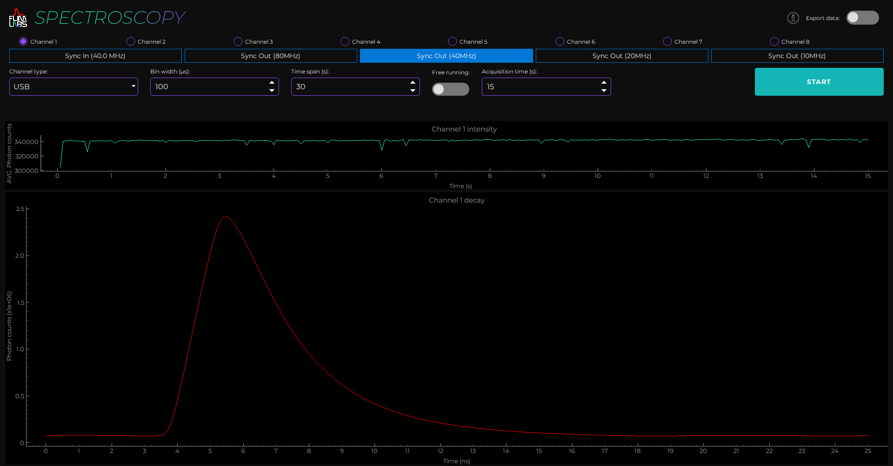
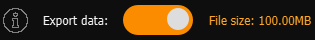
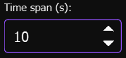
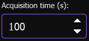

<a name="readme-top"></a>

<div align="center">
  <h1>Spectroscopy v1.0</h1>
</div>
<div align="center">
  <a href="https://www.flimlabs.com/">
    
  </a>
</div>
<br>

<!-- TABLE OF CONTENTS -->
<details>
  <summary>Table of Contents</summary>
  <ol>
    <li>
      <a href="#introduction">Introduction</a>
    </li>
    <li><a href="#gui-usage">GUI Usage</a></li>
    <li><a href="#python-codebase-illustration">Python codebase illustration</a>
    <ul>
      <li><a href="#parameters-configuration">Parameters configuration</a>
      <li><a href="#automatic-plot-update">Automatic plot update</a>
         <ul>
            <li><a href="#pull-from-queue-function">Pull from queue function</a></li>
            <li><a href="#update-plot-2-function">Update plot 2 function</a>
                  <ul>
                      <li><a href="#update-the-photon-intensity-plot">Update the photon intensity plot</a></li>
                      <li><a href="#update-the-photon-intensity-decay-plot">Update the photon intensity decay plot</a></li>
                      <li><a href="#gui-update">GUI update</a></li>
                  </ul>
            </li>         
         </ul>
      <li><a href="#automatic-firmware-detection">Automatic firmware detection</a></li>
      <li><a href="#automatic-firmware-detection">Export Data Visualization</a></li>    
    </ul>
    </li>   
    <li><a href="#license">License</a></li>
    <li><a href="#contact">Contact</a></li>
  </ol>
</details>

<!-- ABOUT THE PROJECT -->

## Introduction

Welcome to [FLIM LABS Spectroscopy](https://github.com/flim-labs/spectroscopy-py) _v1.0_ usage guide. In this documentation section, you will find all the necessary information for the proper use of the application's **graphical user interface** (GUI).
For a general introduction to the aims and technical requirements of the project, read the [Spectroscopy Homepage](../index.md) link.

<p align="right">(<a href="#readme-top">back to top</a>)</p>

<!-- USAGE EXAMPLES -->

## GUI Usage

<div align="center">
    
</div>

The GUI mode provides advanced functionality for configuring analysis **parameters** and displaying live-streamed fluorescence intensity decay data. It allows simultaneous acquisition from up to **8 channels**, offering real-time data visualization in the form of plots.
There are two types of graphs used to represent the data:

Photon intensity graph:

- **X** Axis: represent _aquisition time_
- **Y** Axis: represent _average photon counts_

Photon intensity decay graph:

- **X** Axis: represent _aquisition time_
- **Y** Axis: represent _average photon counts_

This is a quick overview of the steps you need to follow in order to run an experiment.
More specifically starting from the top of the GUI and going down:

- Choose whether to [export the acquired data](#export-data) or not
- Select the acquisition channels (1 or more)
- Select the type of sync for the laser module, whether sync in or sync out
- Select the channel connection type, whether SMA or USB
- Specify the bin width
- Specify the Time span (s)
- Choose whether to use the Free running mode or not
- Specify the acquisition time (s), available only when not using free running mode
- Press the Start button to begin data acquisition
- Press the Stop button to stop data acquisition

We will analyze in more detail each step of the process listed in the section below

### GUI Features

#### Export Data

<div align="center">
    
</div>

Starting from the top right corner, you'll find a switch to activate the data export mode. Once this mode is activated and data acquisition is complete, the software will automatically save the analysis data to a binary file in the following directory: C:\Users\User.flim-labs\data.

<div align="center">
    
</div>

Furthermore, when data export is activated and at least one acquisition channel has been activated, you can see the estimated size of the file to be exported.
The calculation of the size depends on the values of the settings Free running, Acquistion time, Bin width and the number of selected channels.

#### Channels selection

<div align="center">
    
</div>

In the header, just below the export data button, you will find the selection bar for the acquisition channels that will be used for data collection.  
To conduct the experiment, it is mandatory to select at least one channel. More than one channel can be selected at the same time, up to a maximum of 8.

#### Sync in and sync out

<div align="center">
    
</div>

Just below the channel selection section, you'll find buttons for selecting the type of sync port to use and its respective sequence.  
By choosing Sync In, you'll automatically start the process to measure your laser's frequency.  
Alternatively, select one of the Sync Out options by choosing the desired frequency (80MHz, 40MHz, 20MHz, 10MHz).  
When the export data mode is active, the size of the generated file will increase as the number of active channels increases.

#### Channels connection type

<div align="center">
    
</div>

Moving downwards, on the left side of the GUI, you can set the channel connection type.  
Specify whether you will connect to the channels of your FLIM data acquisition card via USB cable or SMA.  
The software will then select the appropriate firmware accordingly.

#### Bin wdith

<div align="center">
    
</div>

Near the channel connection type button, you will find Bin width setting field.  
This value is measured in microseconds and represents the time the software will wait for photon accumulation to be counted.  
More specifically, the software accumulates the counted photons during the bin width period, and plot them as a single point whose value is the average of the counted photons.  
As a result, the larger the bin width value, the larger the size of the exported file will be.

#### Time span

<div align="center">
    
</div>

The input field for time span, measured in seconds, represents the visible time interval on the x-axis.  
Changing this value is purely for representational purposes and does not affect the size of the exported file or the values of the data represented.

#### Free running mode

<div align="center">
    
</div>

Beside the Time Span input field, you'll find the switch to activate the Free Running mode.

<div align="center">
    
</div>

By activating it, you can start a data acquisition without a predetermined maximum duration; the software will continue to acquire data until you click the stop button.  
When the Free Running mode is active, the 'Acquisition time' field is disabled, and the File size of the exported file cannot be pre-calculated because its size depends on the duration of data acquisition. The longer the duration, the larger the size will be.

#### Acquisition time

<div align="center">
    
</div>

Specify the duration of the data acquisition in the acquisition time imput field.
This field is available only when the Free running mode is disabled.
The longer the acquisition time, the larger the size of the exported file will be.

## Python codebase illustration

The Python codebase is responsible for building the GUI for spectroscopy, making the parameters for data acquisition customizable, invoking the FLIM labs APIs which handle the actual data acquisition and processing, and rendering the data returned by the FLIM labs APIs.

### Parameters configuration

Here a table summary of the configurable parameters:

| Parameter            | data-type        | config                                                                             | default | explanation                                                                                                                                       |
| -------------------- | ---------------- | ---------------------------------------------------------------------------------- | ------- | ------------------------------------------------------------------------------------------------------------------------------------------------- |
| `BIN_WIDTH`          | number           | Set the numerical value in microseconds                                            | 1000    | the time duration to wait for photons count accumulation.                                                                                         |
| `CONNECTION_TYPE`    | string           | set the selected connection type for acquisition (USB or SMA)                      | "USB"   | If USB is selected, USB firmware is automatically used. If SMA is selected, SMA firmware is automatically used.                                   |
| `FREE_RUNNING`       | boolean          | Set the acquisition time mode (**True** or **False**)                              | True    | If set to True, the _ACQUISITION_TIME_ is indeterminate. If set to False, the ACQUISITION_TIME param is needed (acquisition duration)             |
| `selected_channels`  | number[]         | set a list of selected acquisition data channels (up to 8). e.g. [0,1,2,3,4,5,6,7] | []      | the list of selected channels for photons data acquisition                                                                                        |
| `TIME_SPAN`          | number           | Time interval, in seconds, for the visible data range on the duration x-axis.      | 5       | For instance, if `time_span` is set to _5s_, the _x-axis_ will scroll to continuously display the latest 5 seconds of real-time data on the chart |
| `ACQUISITION_TIME`   | number/None      | Set the data acquisition duration                                                  | None    | The acquisition duration is indeterminate (None) if _FREE_RUNNING_ is set to True.                                                                |
| `sync_out_10_button` | enabled/disabled | Enable or disable the button                                                       | False   | Choose 10MHz as sync out frequency                                                                                                                |
| `sync_out_20_button` | enabled/disabled | Enable or disable the button                                                       | False   | Choose 20MHz as sync out frequency                                                                                                                |
| `sync_out_40_button` | enabled/disabled | Enable or disable the button                                                       | False   | Choose 40MHz as sync out frequency                                                                                                                |
| `sync_out_80_button` | enabled/disabled | Enable or disable the button                                                       | True    | Choose 80MHz as sync out frequency                                                                                                                |

<br/>

<p align="right">(<a href="#readme-top">back to top</a>)</p>

### Automatic plot update

The software automatically use the `pull from queue` and `update_plots_2` functions in order to update the plots by pulling new data from a queue.

<p align="right">(<a href="#readme-top">back to top</a>)</p>

#### Pull from queue function

The `pull_from_a_queue` function's primary objective is to monitor the queue for new data utilizing the Flim Labs API.  
Upon detecting new data, the function updates the plots accordingly by calling the `update_plot_2` function. If no data is retrieved, the data acquisition process is halted.

```python
def pull_from_queue(self):
        val = flim_labs.pull_from_queue()
        if len(val) > 0:
            for v in val:
                if v == ('end',):  # End of acquisition
                    print("Got end of acquisition, stopping")
                    self.on_start_button_click()
                    self.mode = MODE_STOPPED
                    self.style_start_button()
                    QApplication.processEvents()
                    break
                ((channel,), (time_ns,), intensities) = v
                channel_index = self.selected_channels.index(channel)
                self.update_plots2(channel_index, time_ns, intensities)
                QApplication.processEvents()
```

<p align="right">(<a href="#readme-top">back to top</a>)</p>

#### Update plot 2 function

The purpose of the`update_plot_2` function is to update the plots when receiving new datas by the `pull_from_queue` function.  
The function receive three parameters: `channel_index`, time in nanoseconds `time_ns`, and a data curve `curve`.  
Then extracts the current x (time) and y (average intensity) data for the specified channel from `self.intensity_lines[channel_index].getData()`.

<p align="right">(<a href="#readme-top">back to top</a>)</p>

###### Update the photon intensity plot

- If the current data is undefined or consists solely of a placeholder (for example, if x[0] == 0), it initializes x with the current time converted to seconds (time_ns / 1,000,000,000) and y with the sum of the curve values (np.sum(curve)).
- If data already exists, it appends the new data point, converting the time to seconds and calculating the average intensity.

<p align="right">(<a href="#readme-top">back to top</a>)</p>

###### Update the photon intensity decay plot

- Extracts the current x (time) and y (photon counts) data for the specified channel from self.decay_curves[channel_index].getData().
- Updates the decay curve by adding the current data curve `curve` to the existing y values, without altering x. This indicates that the curve represents an increment or update of photon counts or intensity for the same time interval already depicted in x.

<p align="right">(<a href="#readme-top">back to top</a>)</p>

###### GUI update

- Invokes QApplication.processEvents() to ensure the user interface remains responsive and updates with the new plot data.
- Introduces a brief pause (time.sleep(0.01)) to slow down the update process and potentially reduce the load on the UI or the application's main thread.

```python
def update_plots2(self, channel_index, time_ns, curve):
        x, y = self.intensity_lines[channel_index].getData()
        if x is None or (len(x) == 1 and x[0] == 0):
            x = np.array([time_ns / 1_000_000_000])
            y = np.array([np.sum(curve)])
        else:
            x = np.append(x, time_ns / 1_000_000_000)
            y = np.append(y, np.sum(curve))

        self.intensity_lines[channel_index].setData(x, y)
        x, y = self.decay_curves[channel_index].getData()
        self.decay_curves[channel_index].setData(x, curve + y)
        QApplication.processEvents()
        time.sleep(0.01)
```

<p align="right">(<a href="#readme-top">back to top</a>)</p>

### Automatic firmware detection

In order to start the acquisition process, the function `begin_spectroscopy_experiment` automatically detect the firmware version of your flim data acquisition card.

<p align="right">(<a href="#readme-top">back to top</a>)</p>

## Exported Data Visualization

The application GUI allows the user to export the analysis data in `binary file format`.

The user can also preview the final file size on the GUI. Since the calculation of the size depends on the values of the parameters `SETTINGS_FREE_RUNNING`, `SETTINGS_ACQUISITION_TIME`, `SETTINGS_BIN_WIDTH` and `selected_channels`, the value will be displayed if the following actions have been taken:

- At least one acquisition channel has been activated (`selected_channels` has a length greater than 0).
- export_data_control is active

Here is a code snippet which illustrates the algorithm used for the calculation:

```python
def calc_exported_file_size(self):
        free_running = self.settings.value(SETTINGS_FREE_RUNNING, DEFAULT_FREE_RUNNING)
        acquisition_time = self.settings.value(SETTINGS_ACQUISITION_TIME, DEFAULT_ACQUISITION_TIME)
        bin_width = self.settings.value(SETTINGS_BIN_WIDTH, DEFAULT_BIN_WIDTH)

        if free_running is True or acquisition_time is None:
            file_size_MB = len(self.selected_channels) * (1000 / int(bin_width))
            self.bin_file_size = format_size(file_size_MB * 1024 * 1024)
            self.bin_file_size_label.setText("File size: " + str(self.bin_file_size) + "/s")
        else:
            file_size_MB = int(acquisition_time) * len(self.selected_channels) * (1000 / int(bin_width))
            self.bin_file_size = format_size(file_size_MB * 1024 * 1024)
            self.bin_file_size_label.setText("File size: " + str(self.bin_file_size))
```

<p align="right">(<a href="#readme-top">back to top</a>)</p>

## License

Distributed under the MIT License.

<p align="right">(<a href="#readme-top">back to top</a>)</p>

<!-- CONTACT -->

## Contact

FLIM LABS: info@flimlabs.com

Project Link: [FLIM LABS - Spectroscopy](https://github.com/flim-labs/spectroscopy-py)

<p align="right">(<a href="#readme-top">back to top</a>)</p>
