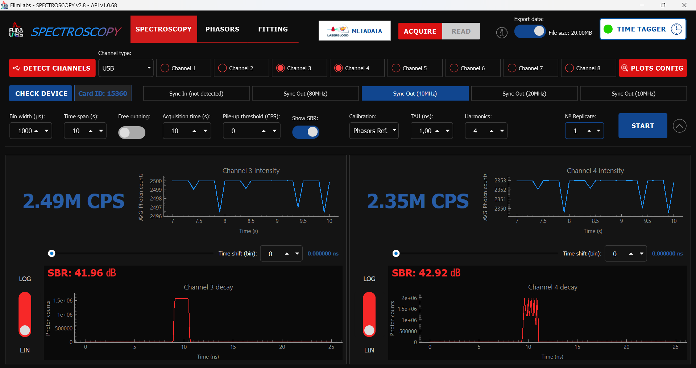
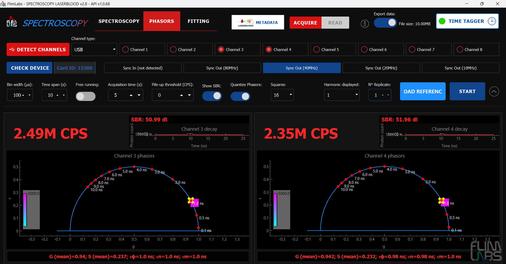
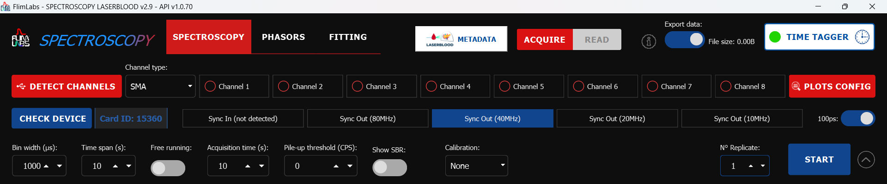
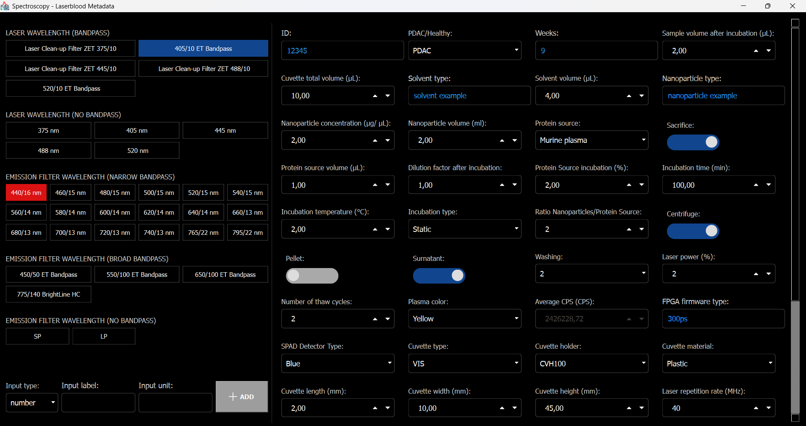
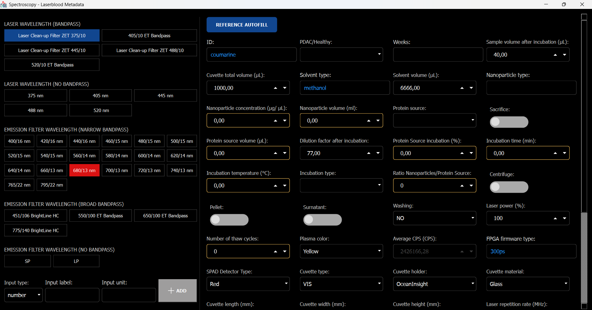
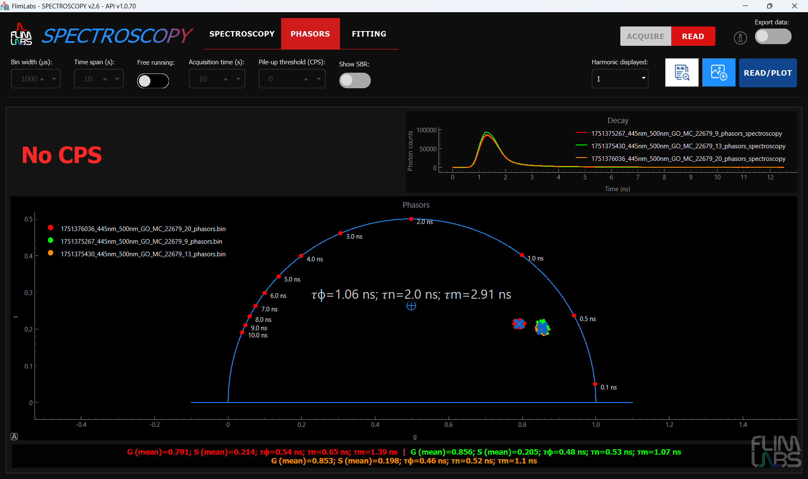

<a name="readme-top"></a>

<div align="center">
  <h1>Spectroscopy Laserblood v3.1</h1>
</div>
<div align="center">
  <a href="https://www.flimlabs.com/">
    
  </a>
</div>
<br>

<!-- TABLE OF CONTENTS -->
<details>
  <summary>Table of Contents</summary>
  <ol>
    <li>
      <a href="#introduction">Introduction</a>
    </li>
    <li><a href="#application-usage">Application Usage</a>
    <ul>
    <li><a href="#spectroscopy-mode">Spectroscopy Mode</a></li>
    <li><a href="#phasors-mode">Phasors Mode</a></li>
    <li><a href="#fitting-mode">Fitting Mode</a></li>
     <li><a href="#settings">Settings</a>
     <ul>
     <li><a href="#acquisition-channels">Acquisition Channels</a></li>
     <li><a href="#connection-type">Connection Type</a></li>
      <li><a href="#sync-in-and-sync-out">Sync in and sync out</a></li>
      <li><a href="#100ps">100ps</a></li>
      <li><a href="#bin-width">Bin width</a></li>
      <li><a href="#time-span">Time span</a></li>
      <li><a href="#acquisition-mode">Acquisition mode</a></li>
      <li><a href="#acquisition-time">Acquisition time</a></li>
      <li><a href="#calibration">Calibration</a></li>
      <li><a href="#pile-up-threshold">Pile-up threshold</a></li>
      <li><a href="#show-sbr">Show SBR</a></li>
      <li><a href="#phasors-parameters">Phasors parameters</a></li>
        <li><a href="#export-data">Export data</a></li>
    <li><a href="#time-tagger">Time Tagger</a></li>
    <li><a href="#parameters-table-summary">Parameters table summary</a></li>
     </ul>
     </li>
         <li><a href="#parameters-configuration-saving">Parameters Configuration Saving</a></li>
            <li><a href="#card-connection-detection">Card Connection Detection</a></li>
           <li><a href="#channels-connections-detection">Channels Connections Detection</a></li>  
    </ul></li>
    <li><a href="#laserblood-metadata">Laserblood Metadata</a>
     <li><a href="#reader-mode">Reader Mode</a></li>
     <li><a href="#export-data">Export Data</a></li>
    <li><a href="#license">License</a></li>
    <li><a href="#contact">Contact</a></li>
  </ol>
</details>

<!-- ABOUT THE PROJECT -->

## Introduction

Welcome to [FLIM LABS Spectroscopy Laserblood](https://github.com/flim-labs/spectroscopy-py) _v3.1_ usage guide. In this documentation section, you will find all the necessary information for the proper use of the application's **graphical user interface** (GUI).
For a general introduction to the aims and technical requirements of the project, read the [Spectroscopy Laserblood Homepage](../index.md) link.

<p align="right">(<a href="#readme-top">back to top</a>)</p>

<!-- USAGE EXAMPLES -->

## Application Usage

<div align="center">
    
</div>

_Spectroscopy_ software provides users with **three distinct analysis modes** to suit various experimental and analytical needs:

- **Spectroscopy Mode**;
- **Phasors Mode**;
- **Fitting Mode**

<hr>

#### Spectroscopy Mode

<div align="center">
    
</div>

**Spectroscopy Mode** allows users to perform in-depth analyses of the **photon intensity decay profile** as a function of time.

The decay curve displayed in the Spectroscopy plot represents the **sum of the curves** for each chunk, where a chunk is defined by the _bin width_ parameter set by the user. Each decay curve is represented by **256** points, maintaining this consistency regardless of the laser frequency used.

Key features of _Spectroscopy Mode_ include:

- **Real-Time Visualization and Analysis**:
  Users can view and analyze both the intensity tracking graph (single-photon counts) and the intensity decay graph in real time.
- **Time Shift Application**:
  The ability to apply a time shift to the decay curve for precise analysis.
- **CPS (Counts Per Second) Display**:
  Shows the average photon counts per second.
- **Pile-Up Threshold Configuration**:
  Users can set a CPS threshold. When the CPS value exceeds the threshold, a graphical effect alerts the user.
- **Linear and Logarithmic Scale Options**:
  The decay plot can be displayed in either linear or logarithmic scale.
- **SBR (Signal-to-Background Ratio) Display:**:
  Allows users to identify potential noise during acquisition.
- **Calibration Mode:**:
  Enables the acquisition of reference parameters that can be used for more advanced analyses in _Phasors Mode_.

<p align="right">(<a href="#readme-top">back to top</a>)</p>
<hr>

#### Phasors Mode

<div align="center">
    
</div>

**Phasors Mode** enables users to conduct advanced analyses of the **lifetime distribution** using **phasor plots**.

Key features of _Phasors Mode_ include:

- **Phasor Points Calculation**:
  Users can compute the phasor points either from a reference acquisition recently performed in the Spectroscopy tab or by loading an external JSON calibration file.
- **Simultaneous Visualization**:
  The decay curve profile and the phasor plot can be displayed side by side for comprehensive analysis.
- **Harmonic Selection**:
  Users can choose which harmonic to visualize on the phasor plot for tailored insights.
- **Point Quantization Adjustment**:
  The level of quantization for the phasor points can be customized to optimize rendering and enhance visibility.
- **Colormap Application**:
  A default colormap is applied to the phasor points, aiding in distinguishing recorded intensity levels.
- **Lifetime points & laser period**:
  The phasor semicircle is automatically populated with key lifetime points based on the selected laser period, simplifying the analysis process.
- **Detailed Statistics**:
  Includes visualization of key metrics such as _G mean_, _S mean_, _τ𝜙_ and _τ𝑚_ for a deeper understanding of the lifetime distribution.

<p align="right">(<a href="#readme-top">back to top</a>)</p>
<hr>

#### Fitting Mode

<div align="center">
    
</div>

**Fitting Mode** allows users to identify and estimate the parameters of the **mathematical decay model** that best describes the acquired data.

Key features of _Fitting Mode_ include:

- **Automated Model Estimation**:
  Utilizes the [scipy](https://scipy.org/) library to automatically suggest the model that best fits the decay profile, selecting from 4 exponential decay models.
- **R² Indicator**:
  Displays the _R²_ value, which quantifies the quality of the fit (values close to 1 indicate a good fit).
- **Graphical Representation of the Fitted Curve**:
  Visualizes the theoretical curve derived from the estimated parameters.
- **Residuals Visualization**:
  Graphically displays the difference between observed and estimated values to assess model accuracy.
- **Linear and Logarithmic Scale Options**:
  Provides flexibility to view data and fits in either linear or logarithmic scale.
- **Region of Interest (ROI) Selection**:
  Allows users to apply the fitting model to a specific ROI of the acquired data for targeted analysis.
- **Use Deconvolution with IRF Reference**:
  If the user enables the "Use deconvolution" option and loads an IRF reference, the acquired signal will be automatically deconvolved before fitting. This process improves the accuracy of the fit by compensating for the instrument response. In this case, both the IRF and the raw (pre-deconvolution) signal are also plotted alongside the fitted curve, allowing for direct visual comparison of all relevant data.  

<p align="right">(<a href="#readme-top">back to top</a>)</p>
<hr>

#### Settings

<div align="center">
    
</div>

_Spectroscopy_ includes a comprehensive **settings** package that allows users to configure their acquisition parameters and hardware connections with ease.

Key features of the settings system include:

- **Customization**:
  Users can tailor various parameters to match their specific acquisition needs, ensuring seamless integration with their hardware setup.

- **Automatic retain of configurations**:
  Every configured setting is automatically saved in a _settings.ini_ file, enabling the software to retain user preferences between sessions. This feature saves time by eliminating the need to reconfigure settings with each use.

Below is a list of configurable settings.

<hr>

##### Acquisition Channels

The software allows for data acquisition in **single-channel** or **multi-channel** mode, with the user able to activate up to _8_ channels simultaneously.

For each activated channel, its respective real-time acquisition plot will be displayed on the interface. If the number of activated channels exceeds 4, only the 4 plots configured via the _PLOTS CONFIG_ button will be displayed, for optimization reasons. Data from channels not displayed will still be exported if the export option is activated.

The number of active channels affects the _size of the exported data file_. With the same values set for `bin width ` and `acquisition time `, the file size _grows proportionally to the number of activated channels_.

To start acquisition, at least one channel must be activated.

_Note: Ensure that the channel activated in the software corresponds to the channel number being used for acquisition on the [FLIM LABS Data Acquisition Card](https://www.flimlabs.com/products/data-acquisition-card/)._

<hr>

##### Connection Type

The user can choose the type of connection for data acquisition between **SMA** and **USB** connections.

_Note: The connection type set in the software must match the actual connection type activated on the [FLIM LABS Data Acquisition Card](https://www.flimlabs.com/products/data-acquisition-card/)._

<hr>

#### Sync in and sync out

By selecting `Sync In`, the user will automatically initiate the process of measuring laser's frequency. Alternatively, by selecting one of the `Sync Out` options, the user can choose the desired frequency (`80MHz`, `40MHz`, `20MHz`, `10MHz`). When the [export data mode](#export-data) is active, the size of the generated file will increase in accordance with the number of active channels.

Selecting the Sync value is essential, as it determines the **laser frequency** and directly impacts the **laser period** and the **time resolution** of the measurements. A higher frequency reduces the laser period, enhancing the **time resolution** and enabling the capture of events in shorter time intervals.  
The X-axis of the graphs reflects the laser period, depicting the time period of a single laser pulse. This aspect is crucial because the decay curve represented on the graph is the sum of curves from each chunk, where each **chunk** is defined by the **bin width** [refer to the bin width section for more details](#bin-width).

The software **automatically adjusts** the time resolution according to the selected frequency, ensuring precision.  
Each decay curve is represented by **256 points**, maintaining this constancy despite changes in frequency or temporal resolution.

Selecting a `Sync out` of 80MHz, we obtain a laser period of 12.5 ns and a temporal resolution of about 48.828 ps; thus, each point represents an interval of approximately 48.828 ps across the cumulative decay curves.

Conversely, at 20MHz, the laser period extends to 50 ns with a temporal resolution of about 195.312 ps, indicating that each point on the curve corresponds to an interval of approximately 195.312 ps across the cumulative decay curves of each chunk.

<hr>

#### 100ps

The **100ps** toggle allows the user to enable or disable the 100 ps mode so that the corresponding firmware can be used.

The pico mode can only be selected when there are at most _2 active channels_ and the laser frequency (either _sync-in_ or _sync-out_) is equal to, or very close to, _40 MHz_ or _80 MHz_.

<hr>

#### Bin width

The user can set a **bin width** value ranging from _100_ to _1,000,000_ microseconds (μs).

The **bin width** value specifies the time interval, in microseconds (μs), used to divide the data acquisition into **chunks**. For each chunk, a theoretical **photon decay curve** is generated. The final graph represents the **cumulative** decay curves of each individual chunk. This approach provides a detailed representation of fluorescence over time, illustrating both the intensity and decay of photon signals.

As an example, consider an [acquisition time](#acquisition-time) of 10 seconds and a bin width of 10,000 microseconds (μs). This configuration results in the creation of 1000 chunks, each contributing to the overall decay curve displayed in the graph.

This methodology allows users to analyze fluorescence data in a more granular manner, enabling the identification of specific signal characteristics and trends.

The configured bin width value affects the size of the exported data file. With the number of `active channels` and `acquisition time` unchanged, the _file size grows inversely proportional to the bin width value_.

<hr>

#### Time span

**Time span** set the time interval, in seconds, for the _last visible data range on the duration x-axis_. For instance, if this value is set to 5s, the x-axis will scroll to continuously display the latest 5 seconds of real-time data on the intensity tracing chart.
Users can choose a value from _1_ to _300_ s (seconds).

<hr>

#### Acquisition mode

Users can choose between two data acquisition modes: **free running** or **fixed acquisition time**.

In free running mode, the total acquisition time is _not specified_. If users deactivate free running mode, they must set a specific acquisition time value.

The chosen acquisition mode impacts the size of the exported data file.

<hr>

#### Acquisition time

When the free running acquisition mode is disabled, users must specify the **acquisition time** parameter to set the total data acquisition duration. Users can choose a value between _1_ and _1800_ s (seconds).

For example, if a value of 10 is set, the acquisition will stop after 10 seconds.

The acquisition time value directly affects the final size of the exported data file. Keeping the `bin width` and `active channels` values unchanged, the _file size increases proportionally to the acquisition time value_.

<hr>

#### Calibration

The **Calibration** setting allows the user to choose between four different calibration types, each serving a specific purpose in the analysis workflow:

- **Phasors Ref**: Enables the acquisition of a reference for phasors analysis. When selected, two additional parameters become available:
  - **TAU (ns)**: Defines the decay time in nanoseconds.
  - **Harmonics**: Allows selection of up to _4_ harmonics for analysis.
  These parameters are used to calculate the reference values for determining phasor points in Phasors Mode.

- **IRF Ref**: Allows the user to acquire the current signal as an **Instrument Response Function (IRF)** reference. This IRF can later be used for deconvolution of a signal in the Fitting tab, improving the accuracy of lifetime estimation by accounting for the system's temporal response.

- **BIRFI Ref**: Enables acquisition of a signal from a known mono-exponential sample (with a known lifetime). The IRF is then extracted from this acquisition using the BIRFI algorithm. The resulting IRF can be used for deconvolution in the Fitting tab, providing enhanced fitting performance, especially when the true IRF is not directly measurable.

- **None**: No reference acquisition is performed. Select this option if you do not wish to acquire or use any calibration reference.

<hr>

#### Pile-up thresholds

Users can set a numeric value for the **Pile-up threshold (CPS)** input to highlight it when the CPS for a specific channel _exceeds that threshold_.

<hr>

#### Show SBR

When the **Show SBR** parameter is enabled, users can view a _Signal-to-Noise Ratio (SBR)_ value for each channel, providing real-time feedback on the level of noise detected during acquisition.

<hr>

#### Phasors Parameters

In _Phasors Mode_, users can configure the following three additional parameters:

- **Quantize Phasors**: determines whether the phasor points should be quantized (grouped into bins), affecting the precision of the graphical representation.

- **Squares**: Available only if _Quantize Phasors_ is active. Specifies the number of bins for grouping the phasor points.

- **Harmonic Displayed**: Visible only after a _Calibration_ involving multiple harmonics. Allows users to select which harmonic to display on the phasor plot.

<hr>

#### Export data

Users can choose to **export acquired data** in _.bin_ file format for further analysis.
Refers to this section for more details:

- [Spectroscopy Laserblood Data Export guide ](../python-flim-labs/spectroscopy-file-format.md)

<hr>

#### Time Tagger

If the user chooses to export the acquired data, they can also opt to enable or disable the export of **Time Tagger data**. When enabled, a .bin file will be exported (along with a Python script to read the .bin file) containing information on the type of _event_ and the _micro-time_ and _macro-time_ (ns) at which it was recorded.

<hr>

#### Laserblood Metadata

<div align="center">
    
</div>

_Spectroscopy Laserblood_ software includes a comprehensive **Laserblood Metadata** system designed specifically for the [Laserblood EU project](https://www.laserblood.eu/), which focuses on the detection of pancreatic ductal adenocarcinoma (PDAC) through innovative photonic technologies.

The **Laserblood Metadata** popup provides a specialized interface for recording detailed experimental parameters essential for biomedical research and clinical applications in cancer detection. This metadata system ensures complete traceability and reproducibility of experiments conducted within the Laserblood project framework.

Key features of the _Laserblood Metadata_ system include:

- **Sample Information Management**:
  Complete tracking of sample characteristics including ID, PDAC/Healthy classification, and plasma properties.

- **Experimental Setup Documentation**:
  Detailed recording of laser parameters, detector specifications, and optical filter configurations.

- **Nanoparticle and Protein Corona Analysis**:
  Comprehensive metadata for nanoparticle-protein interactions, including concentrations, volumes, and incubation conditions.

- **Cuvette and Measurement Parameters**:
  Full specification of measurement vessel properties and experimental conditions.

- **Hardware Configuration Tracking**:
  Documentation of FPGA firmware, detector types, and acquisition parameters.

- **Customizable Fields**:
  Ability to add custom metadata fields to accommodate evolving experimental requirements.

- **Validation and Quality Control**:
  Built-in validation ensures all required fields are properly completed before data acquisition.

The metadata is automatically embedded in exported data files, providing a complete experimental record that supports the reproducibility requirements of clinical research and facilitates data analysis workflows in the Laserblood consortium.

##### Laser and Filter Configuration

The system provides precise configuration options for:

- **Laser Wavelength Selection**: Both bandpass and non-bandpass laser options (375nm, 405nm, 445nm, 488nm, 520nm)
- **Emission Filter Management**: Narrow bandpass, broad bandpass, and non-bandpass filter options
- **Automatic Filter Matching**: Dynamic filter options based on selected laser wavelength

##### Sample and Experimental Parameters

Key configurable parameters include:

- **Sample Identification**: Unique ID and classification (PDAC/Healthy)
- **Nanoparticle Properties**: Type, concentration, and volume specifications
- **Protein Source Details**: Human or murine plasma with volume and incubation parameters
- **Incubation Conditions**: Temperature, time, type (static/dynamic), and protein ratios
- **Processing Steps**: Centrifuge, pellet, supernatant, and washing procedures
- **Measurement Conditions**: Cuvette specifications, laser power, and detector settings

> **New in v2.8.2:**
>
> A **"REFERENCE AUTOFILL"** button has been added, allowing you to prefill the metadata fields with default values from the coumarine reference, so you don't have to enter them manually every time.
>
> **Default values (coumarine reference):**
>
> - **ID:** coumarine
> - **PDAC/healthy:** none
> - **Weeks:** none
> - **Cuvette total volume:** 1000
> - **Solvent type:** methanol
> - **Nanoparticle type/concentration/volume:** none
> - **Protein source/protein source volume/protein source incubation:** none
> - **Incubation time/temperature/type:** 0
> - **Ratio Nanoparticle/protein source:** 0
> - **Washing:** no
> - **Laser power:** 100
> - **Number of thaw cycles:** 0

 <div align="center">
    
</div>

<hr>

#### Parameters table summary

Here a table summary of the configurable parameters:

| Parameter          | Data Type   | Config                                                                                                         | Default   | Explanation                                                                                                                                                               |
| ------------------ | ----------- | -------------------------------------------------------------------------------------------------------------- | --------- | ------------------------------------------------------------------------------------------------------------------------------------------------------------------------- |
| `enabled_channels` | number[]    | Set a list of enabled acquisition data channels (up to 8). e.g. [0,1,2,3,4,5,6,7]                              | []        | The list of enabled channels for photons data acquisition.                                                                                                                |
| `connection_type`  | number      | Set the selected connection type for acquisition (USB or SMA).                                                 | 0 ("USB") | If USB (0) is selected, USB firmware is automatically used. If SMA (1) is selected, SMA firmware is automatically used.                                                   |
| `bin_width`        | number      | Set the numerical value in microseconds. Range: _1-1000000µs_.                                                 | 1000 (µs) | The time duration to wait for photons count accumulation.                                                                                                                 |
| `free_running`     | boolean     | Set the acquisition time mode (_True_ or _False_).                                                             | True      | If set to True, the _acquisition_time_ is indeterminate. If set to False, the `acquisition_time` parameter is needed (acquisition duration).                              |
| `time_span`        | number      | Time interval, in seconds, for the visible data range on the duration x-axis. Range: _1-300s_.                 | 5         | For instance, if `time_span` is set to _5s_, the intensity tracing plot _x-axis_ will scroll to continuously display the latest 5 seconds of real-time data on the chart. |
| `acquisition_time` | number/None | Set the data acquisition duration. Range: _1-1800s_.                                                           | None      | The acquisition duration is indeterminate (None) if _free_running_ is set to True.                                                                                        |
| `cps_threshold`    | number      | Set the CPS threshold.                                                                                         | 0         | If set to a value greater than 0, the user will see the CPS for each channel highlighted when they exceed the set threshold.                                              |
| `show_sbr`         | boolean     | Defines whether to visualize the Signal-to-Noise Ratio value for each channel or not.                          | False     | Enables or disables the SBR visualization.                                                                                                                                |
| `sync`             | string      | Set the laser sync type (in/out) and optionally its frequency.                                                 | _sync_in_ | Configures synchronization for laser input or output.                                                                                                                     |
| `calibration`      | number      | Defines whether to calculate reference parameters for phasors analysis or not.                                | 0 (None)  | If set to **Phasors Ref** (1), a reference file for phasors analysis will be downloaded. If set to **IRF Ref** (2)  or **BIRFI Ref** (3) a reference file for fitting deconvolution will be downloaded                                                                                     |
| `tau_ns`           | number/None | Set the tau (ns) value for Phasors Ref calculation.                                                            | None      | Defines the decay time in nanoseconds for Phasors Ref calculations.                                                                                                       |
| `harmonics`        | number      | Set the number of harmonics (1 to 4) for Phasors Ref calculation.                                              | 1         | Configures the number of harmonics for Phasors Ref calculations.                                                                                                          |
| `quantize_phasors` | boolean     | Defines whether to quantize phasors points or not.                                                             | False     | If set to True, phasor points will be grouped into bins.                                                                                                                  |
| `plots_to_show`    | number[]    | Defines the number of plots to visualize (max 4).                                                              | []        | Specifies the plots to display during acquisition.                                                                                                                        |
| `time_shifts`      | dict        | Defines the key (channel index) / value (time shift) pair for decay curves time shifts.                        | {}        | Configures time shifts for decay curve visualization by channel.                                                                                                          |
| `lin_log_mode`     | dict        | Defines the key (channel index) / value (LIN/LOG) pair for decay curves linear/logarithmic plot visualization. | {}        | Configures the visualization mode (linear or logarithmic) for decay curves by channel.                                                                                    |
| `write_data`       | boolean     | Set export data option to True/False.                                                                          | False     | If set to _True_, the acquired raw data will be exported locally to the computer along with script files (Python/Matlab).                                                 |
| `time_tagger`      | boolean     | Set export Time Tagger data option to True/False.                                                              | True      | If set to _True_, the Time Tagger data will be processed and exported locally to the computer (along with a reader script in Python).                                     |
| `pico_mode`        | boolean     | Set firmware pico-mode (100ps) option to True/False.                                                           | False     | If set to _True_, the acquisition will use a 100ps firmware
| `use_deconvolution`      | boolean     | whether to deconvolve signals before fitting or not.                                                             | False      | If set to _True_, the acquired signal will be deconvolved to enhance fitting results.                                                                                                                 |

<br/>

<p align="right">(<a href="#readme-top">back to top</a>)</p>

### Parameters Configuration Saving

The saving of GUI configuration parameters has been **automated**. Each interaction with the parameters results in the relative value change being stored in a `settings.ini` internal file.

On application restart, the saved configuration is automatically loaded. If the `settings.ini` file is not found, or a specific parameter has not been configured yet, a default configuration will be set.

Here an example of the `settings.ini` structure:

```json
[General]
app_version=3.1
free_running=false
tau_ns=1
calibration=1
connection_type=0
use_deconvolution=false
plots_to_show="[2, 3]"
channel_0=false
channel_1=false
channel_2=true
channel_3=true
channel_4=false
channel_5=false
channel_6=false
channel_7=false
sync=sync_out_40
time_shift="{\"2\": 64, \"3\": 0}"
acquire_read_mode=acquire
harmonic=4
write_data=true
acquisition_time=10
phasors_resolution=2
quantize_phasors=true
lin_log_mode="{\"2\": \"LOG\", \"3\": \"LIN\"}"
pico_mode=false
```

<p align="right">(<a href="#readme-top">back to top</a>)</p>

### Card Connection Detection

The software supports **automatic detection of the Flim Card connection**.
The detection is performed automatically when the app starts and when acquisition begins. The user can also manually run this check at any time by clicking the _CHECK DEVICE_ button. If the card is connected, its ID will be displayed next to the button; otherwise, an error message will appear.

<hr>

<p align="right">(<a href="#readme-top">back to top</a>)</p>

### Channels Connections Detection

The software supports **automatic detection of channels connections**, simply clicking on the _Detect Channels_ button.
If connections are found, the system allows the user to update the configuration settings (Channel Type and enabled channels) in an automated way.

<hr>
<p align="right">(<a href="#readme-top">back to top</a>)</p>


## Reader Mode

<div align="center">
  
</div>

The user can choose to use the software in **Reader mode**, loading .bin/.json files from external **spectroscopy**, **phasors** or **fitting** data acquisitions.
In the **Spectroscopy** tab the user can configure which plots to display, with up to _4_ channels shown simultaneously. For the **Phasors** and **Fitting** tabs, it is possible to load up to a maximum of 4 files at the same time and plot all of them together in a single graph. This allows for direct comparison of multiple acquisitions or fitting results within the same visualization.
Additionally, the user can view the _metadata_ related to the acquisition and download an image in _.png_ and _.eps_ format that replicates the acquisition graphs.

<p align="right">(<a href="#readme-top">back to top</a>)</p>

## Export Data

If the _Export data_ option is enabled, the acquisition .bin file and the **Python** and **Matlab** scripts for manipulating and displaying the acquired data are automatically downloaded at the end of the acquisition, after the user selects a name for the files.

Note: a requirements.txt file — indicating the dependencies needed to run the Python script - will also be automatically downloaded.

Refer to this section for more details:

- [Spectroscopy Data Export guide ](../python-flim-labs/spectroscopy-file-format.md)

<p align="right">(<a href="#readme-top">back to top</a>)</p>

## License

Distributed under the MIT License.

<p align="right">(<a href="#readme-top">back to top</a>)</p>

## License

Distributed under the MIT License.

<p align="right">(<a href="#readme-top">back to top</a>)</p>

<!-- CONTACT -->

## Contact

FLIM LABS: info@flimlabs.com

Project Link: [FLIM LABS - Spectroscopy Laserblood](https://github.com/flim-labs/spectroscopy-py/tree/laserblood)

<p align="right">(<a href="#readme-top">back to top</a>)</p>
